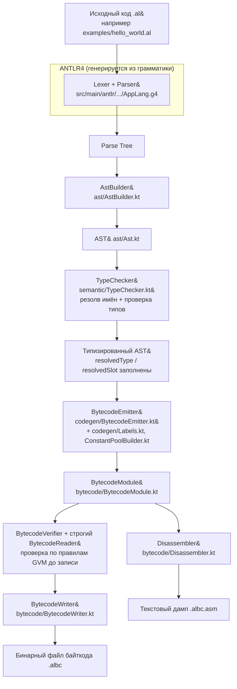

# Gon&On


**Gon&On** — учебный язык программирования с синтаксисом в духе Kotlin/Java
и его компилятор в байткод стековой машины. Проект курса «Разработка
мобильных приложений» (Университет ИТМО): команда разрабатывает упрощённый
аналог Android поверх Linux, и Gon&On — это язык, на котором в итоге должны
писаться мобильные приложения для этой платформы.

Эта часть проекта отвечает **только за язык и компилятор**. Виртуальную
машину, которая исполняет получившийся байткод, реализует другая команда на
C/C++ — она не видит код компилятора и работает исключительно по
спецификации в [`docs/BYTECODE_SPEC.md`](docs/BYTECODE_SPEC.md).

## Как исходный код превращается в байткод


```mermaid
flowchart TD
    A["Исходный код .al&#10;например examples/hello_world.al"] --> B

    subgraph ANTLR4["ANTLR4 (генерируется из грамматики)"]
        B["Lexer + Parser&#10;src/main/antlr/.../AppLang.g4"]
    end

    B --> C["Parse Tree"]
    C --> D["AstBuilder&#10;ast/AstBuilder.kt"]
    D --> E["AST&#10;ast/Ast.kt"]
    E --> F["TypeChecker&#10;semantic/TypeChecker.kt&#10;резолв имён + проверка типов"]
    F --> G["Типизированный AST&#10;resolvedType / resolvedSlot заполнены"]
    G --> H["BytecodeEmitter&#10;codegen/BytecodeEmitter.kt&#10;+ codegen/Labels.kt, ConstantPoolBuilder.kt"]
    H --> I["BytecodeModule&#10;bytecode/BytecodeModule.kt"]
    I --> V["BytecodeVerifier + строгий BytecodeReader&#10;проверка по правилам GVM до записи"]
    V --> J["BytecodeWriter&#10;bytecode/BytecodeWriter.kt"]
    J --> K["Бинарный файл байткода .albc"]
    I --> L["Disassembler&#10;bytecode/Disassembler.kt"]
    L --> M["Текстовый дамп .albc.asm"]
```

Все стадии собраны в `compiler/Compiler.kt`, которым пользуются и CLI, и
тесты. Если на любой стадии находится ошибка — синтаксическая,
семантическая, превышение пределов формата или нарушение правил
верификатора GVM в сгенерированном байткоде, — пайплайн останавливается, CLI
(`cli/Main.kt`) печатает диагностики, а выходной файл не создаётся и не
перезаписывается. Подробнее про каждый шаг — в
[`docs/ARCHITECTURE.md`](docs/ARCHITECTURE.md), про сам формат `.albc` —
в [`docs/BYTECODE_SPEC.md`](docs/BYTECODE_SPEC.md).

## Статус

- **v1** — процедурный базис: функции, переменные, `Int`/`Bool`/`String`,
  `if`/`while`, арифметика. Компилируется в профиль `.albc` **1.0**.
- **v2** — классы: поля, конструктор, методы, `this`, создание экземпляров,
  ссылочная семантика. Программа с классами компилируется в профиль
  `.albc` **2.0** (таблица классов + `ALLOC_OBJECT`/`GET_FIELD`/`SET_FIELD`).

Оба профиля соответствуют контракту с командой GVM
([`docs/backlog/`](docs/backlog/)): сгенерированный байткод проверяется
правилами загрузчика и верификатора GVM до записи файла. Фактический прогон
на GVM пока не выполнялся — её реализация ещё не готова; совместимость
подтверждена тестами по контракту. Дальнейшие шаги — roadmap в
[`docs/LANGUAGE_SPEC.md`](docs/LANGUAGE_SPEC.md#roadmap).

```kotlin
class Counter {
    val value: Int;
    constructor(value: Int) { this.value = value; }
    fun get(): Int { return this.value; }
}

fun main(): Int {
    val counter = Counter(7);
    return counter.get();
}
```

## Требования

- JDK 17+
- Gradle wrapper (входит в репозиторий, отдельно ничего ставить не нужно)

## Сборка и тесты

```bash
./gradlew build        # компиляция + весь тестовый набор
./gradlew test         # только тесты
```

## Компиляция программы на Gon&On

```bash
./gradlew run --args="examples/hello_world.al -o hello.albc --disasm"
```

Флаги CLI (`applangc`):

| Флаг | Назначение |
|---|---|
| `-o <path>` | путь к выходному файлу байткода (по умолчанию `<file>.albc`) |
| `--disasm` | вывести дизассемблированный байткод (модель в памяти, совпадающая с записанным файлом) на stdout |
| `--dump-ast` | вывести AST на stdout (для отладки) |

Коды завершения: `0` — файл записан; `1` — ошибка компиляции, чтения или
записи (диагностики в stderr, выходной файл не тронут); `2` — неверные
аргументы. Исходник читается как UTF-8.

## Структура репозитория

```
src/main/antlr/    грамматика AppLang (ANTLR4)
src/main/kotlin/   компилятор: AST, семантический анализ, codegen, байткод, CLI
src/test/kotlin/   тесты (по одному классу на компонент, см. ниже)
examples/          примеры программ на Gon&On + golden-файлы дизассемблированного байткода
docs/              спецификации языка и байткода, архитектура
docs/backlog/      требования команды GVM и общий бинарный контракт 1.0 / 2.0
```

## Документация

- [`docs/LANGUAGE_SPEC.md`](docs/LANGUAGE_SPEC.md) — грамматика, семантика,
  ограничения v1, roadmap следующих версий языка.
- [`docs/BYTECODE_SPEC.md`](docs/BYTECODE_SPEC.md) — **самодостаточная**
  спецификация набора опкодов и бинарного формата `.albc` для команды,
  разрабатывающей ВМ. Не требует чтения кода компилятора.
- [`docs/ARCHITECTURE.md`](docs/ARCHITECTURE.md) — пайплайн компилятора
  (для отчёта по курсу).
- [`docs/backlog/`](docs/backlog/) — бэклог совместимости с GVM:
  базовый профиль (`base.md`), объектная модель (`oop.md`), решения по
  языку (`language-decisions.md`) и общий бинарный контракт двух команд
  (`bytecode-contract.md`).

## Тестирование

```bash
./gradlew test --tests 'ru.itmo.applang.semantic.TypeCheckerTest'   # один класс
./gradlew test --tests '*TypeCheckerTest.*main*'                     # по шаблону имени
```

Тесты организованы по слоям компилятора (JUnit5, параметризованные наборы
для однотипных кейсов, `@DisplayName` на русском):

- `lexer/LexerTest` — токенизация;
- `parser/ParserTest` — синтаксический анализ, приоритеты операторов;
- `ast/AstBuilderTest` — построение AST;
- `semantic/TypeCheckerTest` — резолв имён и проверка типов (позитив и
  параметризованный негатив: undefined var/function, type mismatch,
  val reassignment, arity mismatch, Unit как значение, строки libstr,
  точка входа `main`, пределы слотов и параметров);
- `semantic/ClassTypeCheckerTest` — правила классов LANG-01…10: имена,
  члены, конструктор, заполненность полей, раскрытие `this`, `val`-поля;
- `codegen/BytecodeEmitterTest` — генерация байткода для представительных
  конструкций (арифметика, if/else, while, вызов функции, short-circuit
  `&&`/`||`, конкатенация строк) и корректность всех целей переходов;
- `bytecode/BytecodeVerifierTest` — правила верификатора GVM: underflow,
  слияния, циклы, возвраты, falloff, индексы, рекурсия;
- `bytecode/BytecodeWriterReaderTest` — round-trip, независимая сверка
  байтов раскладки, строгий reader на испорченных и обрезанных файлах,
  отказ writer'а от невалидного модуля;
- `bytecode/StringConstraintsTest` — контракт строк libstr;
- `bytecode/ObjectProfileTest` — профиль 2.0: эталон контракта на 185 байт,
  ClassTable и объектные инструкции, отказы verifier и reader;
- `cli/CliTest` — коды завершения и сохранность выходного файла при ошибках;
- `e2e/EndToEndExamplesTest` — сквозная компиляция `examples/*.al` через CLI в
  реальный файл, чтение строгим reader'ом и сверка с golden-файлами.

## CI/CD

GitHub Actions (`.github/workflows/ci.yml`) собирает проект и прогоняет
весь тестовый набор на каждый push и pull request в `main`.
